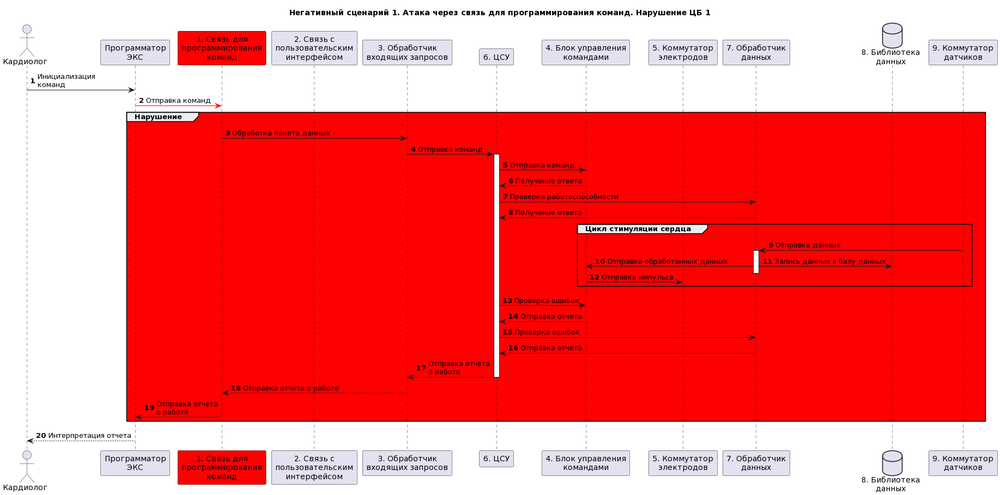

# Отчет о выполнении проекта по дисциплине "Программная инженерия кибериммунных систем" по теме "Cистема управления кардиостимулятором с интерфейсом удалённого доступа"

- [Постановка задачи](#постановка-задачи)
- [Определение ценностей продукта и негативных событий](#определение-ценностей-продукта-и-негативных-сценариев)
- [Роли и пользователи](#роли-и-пользователи)
- [Цели и предположения безопасности](#цели-и-предположения-безопасности)
- [Диаграмма контекста](#диаграмма-контекста)
- [Базовые сценарии](#базовые-сценарии)
- [Оновные блоки](#основные-блоки)
- [Архитектура](#архитектура)
- [Базовый сценарий и HLA](#базовый-сценарий-и-HLA)
- [Негативные сценарии](#негативные-сценарии)
- [Политика архитектуры](#политика-архитектуры)
- [Тесты](#тесты)

## Постановка задачи
Построение безопасной архитектуры и прототипа системы управления кардиостимулятором (ЭКС) с интерфейсом удалённого доступа.

## Определение ценностей продукта и негативных сценариев
| Ценность | Негативные события | Величина ущерба | Комментарий |
|:----------:|:----------:|:----------:|:----------:|
| Пациент | Причинение вреда здоровью | Высокий | Судебные иски |
| Информация с ЭКС | Причинение ущерба | Высокий | Нарушение данных приведет к неправильной оценке состояния пациента |
| ЭКС | Выход из строя | Средний | Потребуется обращение в медицинскую организацию в срочном порядке |

## Роли и пользователи
| Роль | Описание |
|:----------:|:----------:|
| Пациент | Использование ЭКС |
| Кардиолог | Настройка ЭКС |

## Цели и предположения безопасности
### Цели безопасности
1. Команды, подаваемые на ЭКС, аутентифицированы.
2. Доступ к конфиденциальной информации ЭКС аутентифицирован.

### Предположения безопасности
1. Данные, получаемые с датчиков ЭКС достоверны.
2. Лечащий врач благонадежен.
3. Нельзя задать команды через пользовательский интерфейс.

## Диаграмма контекста

## Базовые сценарии

* Стимуляция сердца

## Основные блоки

## Архитектура

## Базовый сценарий и HLA

## Негативные сценарии

## Политика архитектуры
### Итерации разработки
Начальный этап разработки

Разбиение сложного компонента

Оптимизация стимуляции

## Тесты
