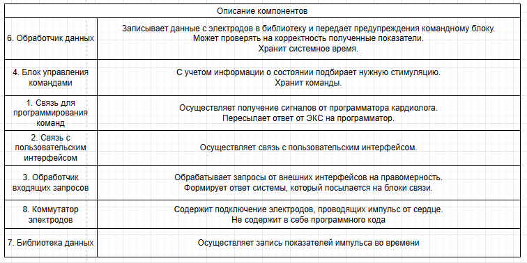
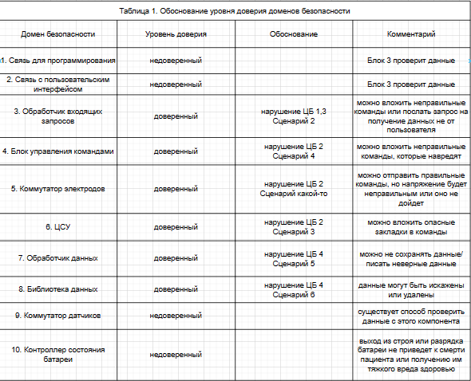

# Отчет о выполнении проекта по дисциплине "Программная инженерия кибериммунных систем" по теме "Cистема управления кардиостимулятором с интерфейсом удалённого доступа"

- [Постановка задачи](#постановка-задачи)
- [Определение ценностей продукта и негативных событий](#определение-ценностей-продукта-и-негативных-сценариев)
- [Роли и пользователи](#роли-и-пользователи)
- [Цели и предположения безопасности](#цели-и-предположения-безопасности)
- [Диаграмма контекста](#диаграмма-контекста)
- [Базовые сценарии](#базовые-сценарии)
- [Оновные блоки](#основные-блоки)
- [Архитектура](#архитектура)
- [Базовый сценарий и HLA](#базовый-сценарий-и-HLA)
- [Негативные сценарии](#негативные-сценарии)
- [Политика архитектуры](#политика-архитектуры)
- [Тесты](#тесты)

## Постановка задачи
Построение безопасной архитектуры и прототипа системы управления электрокардиостимулятором (ЭКС) с интерфейсом удалённого доступа.

Для упрощения разработки было приянто решение разарботать архитектуру ЭКС, имеющего код AAI. Это означает, что:
* Стимулируемая камера - предсердие (A)
* Детектируемая камера - предсердие (A)
* Ингибирование стимулятора в ответ на детектированный сигнал (I)

В дополнение к этому, ЭКС имеет только электроды и повторители, осуществляющие стимуляцию и собирающие обратный импульс соответственно. Отсутствуют какие-либо оптические датчики и акселерометры для сбора всевозможной дополнительной информации о состоянии пациента.

Стоит отметить, что разрабатываемый ЭКС применяется только при диагнозах брадикардии и, возможно, аритмии. Командой разработки это рассматривается как поддержание нормальной частоты сердечных сокращений, и при превышении этого порога стимуляция осуществляется в меньшей степени.

Удаленный интерфейс доступа к ЭКС основан на коммерческой технологии Home Monitoring BIOTRONIK,
суть которой заключается в установлении телеметрической связи между ЭКС и прибором пациента “Cardiomessenger” (на базе модифицированного мобильного телефона) для создания единой замкнутой коммуникационной системы «устройство – “Cardiomessenger” – сервисный центр BIOTRONIK – лечащий врач – пациент».
Устройство пользовательского интерфейса способно принимать данные с ЭКС и передавать их в мед. учреждение.

## Определение ценностей продукта и негативных сценариев
| Ценность | Негативные события | Величина ущерба | Комментарий |
|:----------:|:----------:|:----------:|:----------:|
| Пациент | Причинение тяжкого вреда здоровью или летальный исход | Высокий | Судебные иски |
| Информация с ЭКС | Компрометация или несанкционированный доступ | Высокий | Нарушение данных приведет к неправильной оценке состояния пациента |
| ЭКС | Выход из строя | Средний | Потребуется обращение в медицинскую организацию в срочном порядке |

## Роли и пользователи
| Роль | Описание |
|:----------:|:----------:|
| Пациент | Использование ЭКС |
| Кардиолог | Настройка ЭКС |

## Цели и предположения безопасности
### Цели безопасности
1. Выполняются команды только от аутентичных и авторизованных пользователей.
2. Не действительна. Команды, которые отвечают за стимуляцию сердца, не причиняют вред здоровью пациента.

Принято решение об исключении этой цели безопасности ввиду того, что она достигается путем выполнения команд только от аутентичных и авторизованных пользователей, являющихся благонадежными. Также команды подбираются индивидуально для каждого пациента, следовательно, проверить их на опасность достаточно сложно. Можно только выделить очевидно опасные команды, посылающие очень высокий импульс, но для их отсеивания нет необходимости создавать отдельный модуль или писать много кода.

4. Доступ к конфиденциальной информации ЭКС имеют только аутентичные и авторизованные пользователи.
5. Временные показатели частоты сердечного ритма и другая информация о состоянии пациента, хранящаяся в библиотеке данных, достоверны и не противоречивы.

### Предположения безопасности
1. Данные, получаемые с датчиков ЭКС, достоверны. (Стоит отметить, что хоть и данные с датчиков достоверны, но они могут исказиться см. "Дополнительные меры защиты". Учитывая, что датчики содержатся в устройстве, программную архитектуру которого мы разрабатываем, мы несем некоторую ответственность за них. Этим предположением мы гарантируем себе то, что датчики физически работают корректно.)
2. Лечащий врач благонадежен.
3. Программатор ЭКС благонадежен.
4. Устройство для взаимодействия с пользователем благонадежно.

#### Дополгительные меры защиты
Узнать, достоверны ли данные с датчиков можно, если мы видим, что сердце посылает нам электрический сигнал после того, как совершило удар менее чем 200 мс назад, это доказывает, что нас обманули по поводу предыдущего удара пульса. Если подобное имеет место, значит, мы получаем преднамеренные электромагнитные помехи.

Также, чтобы проверить наличие вируса в ПО, можно изучить энергопотребление. В случае значительного превышения потребления энергии с высокой долей вероятности в системе находится вирус, который вызывает эту аномалию.

## Диаграмма контекста

## Базовые сценарии

* Стимуляция сердца

## Основные блоки

## Архитектура

## Базовый сценарий и HLA

## Негативные сценарии

## Политика архитектуры
### Итерации разработки
Начальный этап разработки

Разбиение сложного компонента

Оптимизация стимуляции

Уменьшение доверенной кодовой базы

Обоснование доверия

Была пересмотрена постановка задачи и немного упрощена и уточнена. Исключены коммутаторы ввиду того, что они теоретически не содержат программного кода и являются физическими устройствами. Упразднена ЦБ 2, поэтому блок управления командами стал проще. Было оптимизировано максимальное число всех интерфейсов для одного блока среди всех блоков, теперь оно 6 вместо 8. Вместо ЦСУ стал Концентратор информации системы, который отвечает за сбор информации с блоков, передачу команд для стимуляции, а также отправку ошибок и всей информации для последующей пересылки обработчику входящих запросов.

Обоснование доверия выглядит следующим образом

После очередной консультации было принято решение об удалении концентратора информации системы, ввиду отсутствия действительной необходимости в нем. Контроллер состояния батареи был отнесен к блоку обработки входящих запросов, т.к. включение его в круг обмена информацией, содержащего обработчик данных и блок управления командами, могло бы нарушить основную задачу ЭКС – стимуляцию сердца, нагружая бесполезными запросами, или компрометируя поступающие команды или данные из библиотеки. В худшем случае не будет возможности получить данные с ЭКС, что не противоречит целям безопасности и не наносит ущерб ценностям. Такие изменения повлекли за собой увеличение сложности доверенного компонента и максимального количества интерфейсов, однако это не скажется отрицательно на основной задаче ЭКС.

## Тесты
